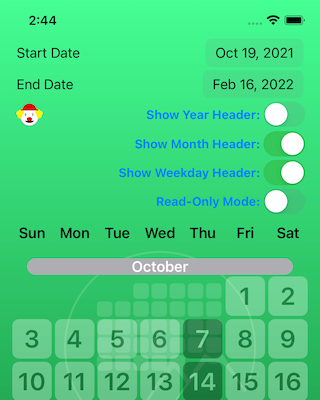
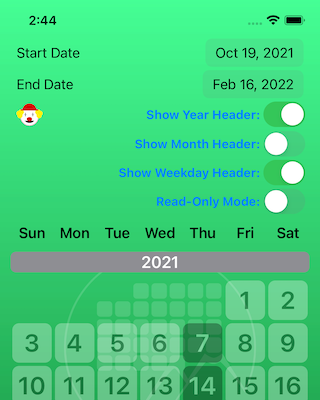
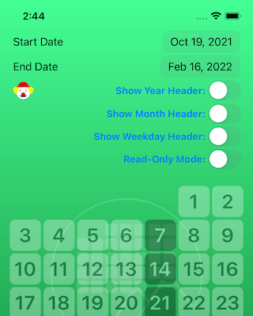

# RVS_CalendarInput

---
**NOTE**

[Here is a link to the GitHub repo for this project.](https://github.com/RiftValleySoftware/RVS_CalendarInput/)

[Here is a link to the technical documentation for this project.](https://riftvalleysoftware.github.io/RVS_CalendarInput/)

---

## INTRODUCTION
RVS_CalendarInput is a customized [UIView](https://developer.apple.com/documentation/uikit/uiview) implementation, that will display a basic month/grid calendar, with active buttons, on selected dates.

The workflow may be familiar to people that have used Web-based "booking" systems. A date grid is presented, in calendar form, with certain dates highlighted as toggle buttons. The user can select these dates.
 
## WHAT PROBLEM DOES IT SOLVE?
Unlike some of the other open-source widgets that we've produced, this widget is being designed for a single application and workflow, so it will be less "general purpose" than other Great Rift Valley Software Company widgets.

In our application, we are adding a workflow, that allows the user of the app to declare that they will be attending events on certain dates. This widget is how they will do that.

## HOW DOES IT WORK?
The user is presented with a grid of possible dates, and certain dates are enabled. This is visually indicated by a combination of colors/contrasts, and transparency. The user can select or deselect enabled dates, and the view will contain a scroller, allowing the implementor to present a range of possible dates. When the user selects an enabled date, its state will toggle. The stored dataset will have that date modified, and the delegate will be informed of the change.

There are headers for wekdays, years and months. They can all be individually hidden. The weekdays header is "fixed." The scroller will scroll underneath it.

The widget is completely localized, respecting the user's calendar and week start. All weekdays and months are displayed in the localized form. It also adapts well to various layouts, and can have its headers and other items customized.

## REQUIREMENTS

This is a [Swift](https://apple.com/swift)-only module. It is based on [standard UIKit](https://developer.apple.com/documentation/uikit), for [iOS](https://apple.com/ios)/[iPadOS](https://apple.com/ipados).

There are no dependencies for the widget, or the test harness app.

## HOW DO WE USE IT?
The widget consists of just [one single source file](https://github.com/RiftValleySoftware/RVS_CalendarInput/blob/master/Sources/RVS_CalendarInput/RVS_CalendarInput.swift). That's all that is needed for your project. Everything else is testing and documentation. You can access this file in several ways.

### INSTALLATION

#### Where to Get the Package

You can get this package as a [Swift Package Manager](https://swift.org/package-manager/) (SPM) package, or you can include it, using [GitHub's Carthage Package Manager](https://github.com/Carthage/Carthage). Finally, you can also [directly access the GitHub repository](https://github.com/RiftValleySoftware/RVS_CalendarInput), and simply include [the single source file](https://github.com/RiftValleySoftware/RVS_CalendarInput/blob/master/Sources/RVS_CalendarInput/RVS_CalendarInput.swift) into your app.

##### The Swift Package Manager

In order to use the SPM, add the package to your project with its GitHub repo location:

    git@github.com:RiftValleySoftware/RVS_CalendarInput.git (SSH),

or

    https://github.com/RiftValleySoftware/RVS_CalendarInput.git (HTTPS).

Add the static `RVS_CalendarInput` library to your project, and add the following `import` line to the top of the files that will use the widget:

    import RVS_CalendarInput
    
##### Carthage

Add the following line to your [Cartfile](https://github.com/Carthage/Carthage/blob/master/Documentation/Artifacts.md#cartfile):

    github "RiftValleySoftware/RVS_CalendarInput.git"
    
Then, run `carthage update` in the main project directory.

This will create a directory, called "Carthage". Inside of that, will be another directory, called `Checkins`. Inside of that, will be [`RVS_CalendarInput/Sources/RVS_CalendarInput/RVS_CalendarInput.swift`](https://github.com/RiftValleySoftware/RVS_CalendarInput/blob/master/Sources/RVS_CalendarInput/RVS_CalendarInput.swift).

I recommend that you include this file directly into your app, as opposed to building the library, and adding that. If you do this, there will be no need to import a module. Additionally, the IBDesignables stuff should work (these are the previews in the storyboard file).

##### Directly From GitHub

The above Carthage instructions will also basically apply to getting the file from GitHub. You can use the following GitHub URLs to access the repository:

    git@github.com:RiftValleySoftware/RVS_CalendarInput.git (SSH),

or

    https://github.com/RiftValleySoftware/RVS_CalendarInput.git (HTTPS).

You can add the repo as a [Git Submodule](https://git-scm.com/book/en/v2/Git-Tools-Submodules), or even as a separate repo, that you use as a source for the physical file.

Get the same file, as indicated by Carthage, and add it to your project.

### IMPLEMENTATION
The implementor will instantiate an instance of this class (either via storyboard, or programmatically). They will then present an array of date objects (conforming to [ `RVS_CalendarInput_DateItemProtocol`](https://riftvalleysoftware.github.io/RVS_CalendarInput/Classes/RVS_CalendarInput/RVS_CalendarInput_DateItemProtocol.html)) to the widget, and the widget will configure itself around that array.

The minimal unit is a month. Months will always be displayed completely, from the first day of the month, to the last. The dataset's earliest date will determine the starting month, athe the dataset's latest date, the final month of the dataset. The dataset does not need to be sorted, upon presentation, but the internal dataset will always be sorted (by date). [There is a useful Array Extension](https://riftvalleysoftware.github.io/RVS_CalendarInput/Extensions/Array.html), for filtering the dataset.

There must be at least one date in the array presented. Any additional dates will be synthesized within the widget (for example, if one date is the twentieth of a month, the entire month, including all the other days that were not provided, will be created).

Only dates specifically in the initial set can be enabled and/or selected (Not required. These dates can also be disabled and/or deselected). All other (artificial) dates will be deselected and disabled.

Implementors can register as [delegates](https://riftvalleysoftware.github.io/RVS_CalendarInput/Protocols/RVS_CalendarInputDelegate.html), to [receive notifications](https://riftvalleysoftware.github.io/RVS_CalendarInput/Protocols/RVS_CalendarInputDelegate.html#/s:17RVS_CalendarInput0a1_bC8DelegateP08calendarC0_15dateItemChangedyA2AC_AA0a1_bc5_DateG8Protocol_ptF), when the user [de]selects a day, or they can examine an array of data objects, representing the state of the control.

### Accessible Instance Properties
All of these properties have default values, but can be altered at runtime.

***NOTE:** The disabled items will always be displayed in monochrome, and transparent. You can adjust the transparency and the font, but not the color.*

- `calendar: Calendar`
This contains the calendar used for the control. It defaults to the current calendar, but can be changed.
    
- `weekdayHeaderFont: UIFont`
The font to be used for the weekday header, at the top.

- `yearHeaderFont: UIFont`
The font to be used for the year header.

- `monthHeaderFont: UIFont`
The font to be used for the month header.

- `weekdayFont: UIFont`
The font to be used for each of the days (both enabled and disabled).

- `enabledItemBackgroundColor: UIColor`
 This is the color for the background of unselected and enabled days.
 The [`UIView.tintColor`](https://developer.apple.com/documentation/uikit/uiview/1622467-tintcolor) property is used to set the font color for the enabled days (and becomes the background, when the day is selected).
 If the day is selected, this becomes the font color.

- `weekdayHeaderFontColor: UIColor`
The font to be used for the weekday header, at the top.

- `yearHeaderFontColor: UIColor`
The font color to be used for the year header.

- `monthHeaderFontColor: UIColor`
The font color to be used for the month header.

- `yearHeaderBackgroundColor: UIColor`
The background color to be used for the year header.

- `monthHeaderBackgroundColor: UIColor`
The background color to be used for the month header.

- `disabledAlpha: CGFloat`
The opacity of disabled date buttons.

- `showMonthHeaders: Bool`
If this is false (default is true), then the month headers will not be shown.

- `showYearHeaders: Bool`
If this is false (default is true), then the year headers will not be shown.

- `showWeekdayHeader: Bool`
If this is false (default is true), then the weekday header will not be shown.

- `delegate: RVS_CalendarInputDelegate?`
This is the delegate that is used to receive notifications of date items changing. The delegate needs to be a class, and this is a weak reference.
This is not IB-accessible, because we don't want to require delegates to conform to [`NSObjectProtocol`](https://developer.apple.com/documentation/objectivec/nsobjectprotocol)

## PROVIDING DATA
The calendar develops its month range, dependent upon an Array of elementa that conform to [the `RVS_CalendarInput_DateItemProtocol` protocol](https://riftvalleysoftware.github.io/RVS_CalendarInput/Protocols/RVS_CalendarInput_DateItemProtocol.html). This protocol defines some basic characteristics that define the date, itself, whether or not it is selected, and/or enabled, and also, you can attach a "reference context," which is an arbitrary entity. "Refrence Context" is an old pattern, and is how we can attach any type of information, in a type-blind manner, to an element of information.

Each element that conforms to [the `RVS_CalendarInput_DateItemProtocol` protocol](https://riftvalleysoftware.github.io/RVS_CalendarInput/Protocols/RVS_CalendarInput_DateItemProtocol.html), must implement the following properties or computed properties:

- [`year: Int`](https://riftvalleysoftware.github.io/RVS_CalendarInput/Protocols/RVS_CalendarInput_DateItemProtocol.html#/s:17RVS_CalendarInput0a1_bC17_DateItemProtocolP4yearSivp)
- [`month: Int`](https://riftvalleysoftware.github.io/RVS_CalendarInput/Protocols/RVS_CalendarInput_DateItemProtocol.html#/s:17RVS_CalendarInput0a1_bC17_DateItemProtocolP5monthSivp)
- [`day: Int`](https://riftvalleysoftware.github.io/RVS_CalendarInput/Protocols/RVS_CalendarInput_DateItemProtocol.html#/s:17RVS_CalendarInput0a1_bC17_DateItemProtocolP3daySivp)
- [`isEnabled: Bool`](https://riftvalleysoftware.github.io/RVS_CalendarInput/Protocols/RVS_CalendarInput_DateItemProtocol.html#/s:17RVS_CalendarInput0a1_bC17_DateItemProtocolP9isEnabledSbvp)
- [`isSelected: Bool`](https://riftvalleysoftware.github.io/RVS_CalendarInput/Protocols/RVS_CalendarInput_DateItemProtocol.html#/s:17RVS_CalendarInput0a1_bC17_DateItemProtocolP10isSelectedSbvp)
- [`refCon: Any?`](https://riftvalleysoftware.github.io/RVS_CalendarInput/Protocols/RVS_CalendarInput_DateItemProtocol.html#/s:17RVS_CalendarInput0a1_bC17_DateItemProtocolP6refConypSgvp)

You present the data to the control, by creating an Array that contains a series of elements that conform to this protocol, and the widget will automatically configure itself to display the dates, in the range specified by the Array.

### The Smallest Unit Is One Whole Month
The control displays dates in blocks of entire months. If a date in the Array falls anywhere in that month, then the entire month of dates is displayed. The range of months will go from the month that contains the earliest date in the Array (the Array does not need to be ordered), to the month that contains the latest date in the Array.

Any days not specifically mentioned in the Array, will be shown as disabled, and unselected.

### The Array Is Given to The Control in An Initializer, or Via A "Write-Only" Property
There is [a convenience initializer](https://riftvalleysoftware.github.io/RVS_CalendarInput/Classes/RVS_CalendarInput.html#/s:17RVS_CalendarInputAAC5frame9setUpData8delegateABSo6CGRectV_SayAA0a1_bC17_DateItemProtocol_pGAA0a1_bC8Delegate_pSgtcfc) that can be used to set the initial data, or you can set the control up, at any time, by setting the Array to the [`setupData`](https://riftvalleysoftware.github.io/RVS_CalendarInput/Classes/RVS_CalendarInput.html#/s:17RVS_CalendarInputAAC9setupDataSayAA0a1_bC17_DateItemProtocol_pGvp) property. Setting this property will recalculate the date range, and redraw the widget.

### The Data Is Copied
When the data is presented to the widget, it is used to create an internal Array that copies the relevant data from the presented Array. It does not reference the Array elements. Internally, the Array is treated as classes (reference context), so viewing the [`data`](https://riftvalleysoftware.github.io/RVS_CalendarInput/Classes/RVS_CalendarInput.html#/s:17RVS_CalendarInputAAC4dataSayAA0a1_bC17_DateItemProtocol_pGvp) Array looks at references, but these are not referenced to the original data that was presented.

## MORE INFORMATION
The control does not derive from [`UIControl`](https://developer.apple.com/documentation/uikit/uicontrol).
This is because the [`UIControl`](https://developer.apple.com/documentation/uikit/uicontrol) event targeting system would not be useful for the types of interactions
that can occur with this control.
Instead, the implementor should register as a [delegate (`RVS_CalendarInputDelegate`)](https://riftvalleysoftware.github.io/RVS_CalendarInput/Protocols/RVS_CalendarInputDelegate.html), and [receive messages, when the control is used](https://riftvalleysoftware.github.io/RVS_CalendarInput/Protocols/RVS_CalendarInputDelegate.html#/s:17RVS_CalendarInput0a1_bC8DelegateP08calendarC0_15dateItemChangedyA2AC_AA0a1_bc5_DateG8Protocol_ptF).
The implementor can always examine the [`data` array](https://github.com/RiftValleySoftware/RVS_CalendarInput/blob/master/Sources/RVS_CalendarInput/RVS_CalendarInput.swift#L315), and determine the control state. That array is updated in realtime.
The data is kept in an array of [`RVS_CalendarInput_DateItemProtocol`](https://riftvalleysoftware.github.io/RVS_CalendarInput/Classes/RVS_CalendarInput/RVS_CalendarInput_DateItemProtocol.html) instances. The widget maintains an internal array that cannot be affected from outside the control, but can be read.

The control is entirely executed in programmatic autolayout. All the implementor needs to do, is instantiate an instance of this class, position it in the layout, and supply it with an initial dataset. The widget, itself, uses autolayout to maintain its internal layout. All the user needs to worry about, is positioning the widget as a rectangle, in their own layout.

The colors for most of the control can be customized, but the disabled colors will always be based on the system background color (and the days will be slightly transparent). You cannot change the color of the disabled days.

The widget class is also declared as [`open`](https://docs.swift.org/swift-book/LanguageGuide/AccessControl.html#ID5), so it can be subclassed, and completely modified.

## THE TEST HARNESS APP
The test harness app is a simple, 1-screen iOS app that presents the widget under a "dashboard." The default date range goes from one (or, occasionally, two) month[s] prior to today, to up to four subsequent months. The same weekday as today, is highlighted in all the displayed days (that fall within the date range).

### THE BASICS

"Today" is enabled and selected (note October 31, in Figure 1). Subsequent instances of the same weekday as "today," are enabled, but not highlighted (note November 7 - January 22, in Figure 1 and Figure 2) The enabled days end at the end date, specified in the date picker. Even if there are more displayed days in the widget, after the end date, they will not be enabled or selected (note January 30 in Figure 2).

Past days are always disabled. Past days of the same weekday, after the start date, are also selected (note October 3-24, in Figure 1).

|  |  |
| - | - |
| Figure 1: The Test Harness Default Screen | Figure 2: The Test Harness Default Screen (Scrolled) |

### HIDING HEADERS

The three switches in the dashboard will hide the widget headers. Figures 3-6 will show how this happens:

|  |  |
| - | - |
| Figure 3: Hiding the Year Header | Figure 4: Hiding the Month Header |

|  |  |
| - | - |
| Figure 5: Hiding the Weekday Header | Figure 6: Hiding All Headers |

### CHANGING DATE RANGES

Use the date pickers to choose a range. Note that any days before today (this file was authored on October 31, 2021 -Happy Halloween!) will be disabled. The same weekday as today, will be highlighted.

|  |  |
| - | - |
| Figure 7: Selecting the Month of October, 2021 | Figure 8: Leaving Out Today (October 31) |

In Figure 8, we restrict the range, so that today is not included, so we do not get October 31 selected and enabled, even though it is displayed.

### "CLOWN MODE"

If you hit the little "clown" button, the colors of the widget will be customized to some truly ghastly colors (Not to worry. Hit the button again, and you'll get the defaults back):

|  |  |
| - | - |
| Figure 9: Clown Mode On | Figure 10: Clown Mode Off |

### BROWSE THE CODE

[The source code for the test harness](https://github.com/RiftValleySoftware/RVS_CalendarInput/tree/master/Tests/RVS_CalendarInput/RVS_CalendarInputTestHarness) should give a good example of how to use the app.

## LICENSE

MIT License

Copyright (c) 2021 Rift Valley Software, Inc.

Permission is hereby granted, free of charge, to any person obtaining a copy
of this software and associated documentation files (the "Software"), to deal
in the Software without restriction, including without limitation the rights
to use, copy, modify, merge, publish, distribute, sublicense, and/or sell
copies of the Software, and to permit persons to whom the Software is
furnished to do so, subject to the following conditions:

The above copyright notice and this permission notice shall be included in all
copies or substantial portions of the Software.

THE SOFTWARE IS PROVIDED "AS IS", WITHOUT WARRANTY OF ANY KIND, EXPRESS OR
IMPLIED, INCLUDING BUT NOT LIMITED TO THE WARRANTIES OF MERCHANTABILITY,
FITNESS FOR A PARTICULAR PURPOSE AND NONINFRINGEMENT. IN NO EVENT SHALL THE
AUTHORS OR COPYRIGHT HOLDERS BE LIABLE FOR ANY CLAIM, DAMAGES OR OTHER
LIABILITY, WHETHER IN AN ACTION OF CONTRACT, TORT OR OTHERWISE, ARISING FROM,
OUT OF OR IN CONNECTION WITH THE SOFTWARE OR THE USE OR OTHER DEALINGS IN THE
SOFTWARE.
